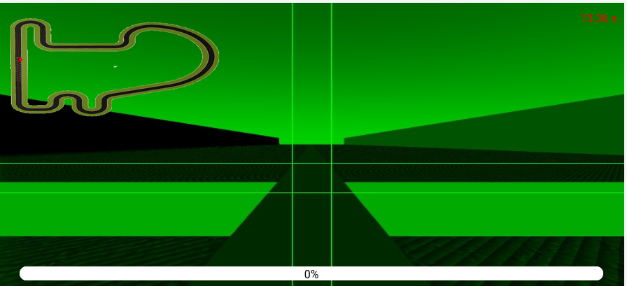

 
# PRACTICE 2: DOCUMENTATION OF FOLLOW LINE

 Irene Diez de Toro
 
 October 2024 - Third Year of Robotic Software Robotics Engineering

# 0. INTRODUCTION

For this second project, the objective was to program a control algorithm for a **formula 1** car. To achieve this, the car had to detect, using a forward-facing color camera, a red line in the center of the lane and follow it. We had to implement code that processed the images returned by the camera to be able to follow the red line painted on the lane. Additionally, we had to program a control command generator for the linear and angular velocities through a PID in order to steer the car to the finish line in the shortest time possible. Moreover, as a special case, we could implement an extra behavior so that when the car lost the line, it could find it again.

# 1. THEORICAL CONCEPTS

DETECTING LINE

The first task of the assignment is to detect the line to be followed. This can be achieved easily by filtering the color of the line from the image and applying basic image processing to find the point or line to follow, or in Control terms our Set Point. Using color filter like HSV.

CONTROL SYSTEM

A system of devices or set of devices, that manages, commands, directs or regulates the behavior of other devices or systems to achieve the desired results. Simply speaking, a system which controls other systems. Control Systems help a robot to execute a set of commands precisely, in the presence of unforeseen errors. Types of Control System:

 - Open Loop Control System: A control system in which the control action is completely independent of the output of the system. A manual control system is on Open Loop System.
 - Closed Loop Control System: A control system in which the output has an effect on the input quantity in such a manner that the input will adjust itself based on the output generated. An open loop system can be converted to a closed one by providing feedback.
 - PID Control: A control loop mechanism employing feedback. A PID Controller continuously calculates an error value as the difference between desired output and the current output and applies a correction based on proportional, integral and derivative terms(denoted by P, I, D respectively).
     - Proportional: Proportional Controller gives an output which is proportional to the current error. The error is multiplied with a proportionality constant to get the output. And hence, is 0 if the error is 0.
     - Integral: Integral Controller provides a necessary action to eliminate the offset error which is accumulated by the P Controller.It integrates the error over a period of time until the error value reaches to zero.
     - Derivative: Derivative Controller gives an output depending upon the rate of change or error with respect to time. It gives the kick start for the output thereby increasing system response.

# 2. MY ALGORITHM

My algorithm consists of filtering the image and following the line as quickly as possible. Specifically, from the image provided by the camera, I filter it using the HSV color space. Once filtered, I use a mask that focuses solely on the red line. Then, I identify the center of the red line I am following, using moment functions to obtain the corresponding coordinates.

From this point, I calculate the error based on the position of the center of the line relative to the center of the image, which represents the target that the car must follow. This error is defined as the difference between these two positions. If the car deviates to one side, the error value will be positive or negative, depending on the direction of the deviation.

With the calculated error, the algorithm determines the linear and angular velocities of the car, using PID controllers to adjust these values:
- Linear Velocity: This is set based on the error. If the error is small, the car moves at a constant speed.
- Angular Velocity: If the error is significant (i.e., if the car is far from the center of the line), the PID controller adjusts the angular velocity to turn the car in the right direction and align it with the line.

In the event that the red line is not detected (for example, if the car strays too far from the line), the algorithm adjusts its behavior. It stops the linear velocity and continues with angular control based on the last known error, attempting to recover the line by turning in the direction the car believes it should be heading.

Lastly, I will present images showing how long my algorithm takes on various maps, as the time taken for the simpler map can be seen in the video provided at the end of the page.

  
  &nbsp;&nbsp;&nbsp;

  
  &nbsp;&nbsp;&nbsp;

  
  &nbsp;&nbsp;&nbsp;

# 3. THE PROCESS

- Image filter
The first steps involved filtering the image and focusing on the specified pixel. Below are images showing the progression:

Using the provided code for image filtering, I created a square simulating the region I wanted to focus on, while also experimenting with different colors using the color filter. To ensure accurate detection, I iterated over the rows and columns of pixels within the defined region, analyzing each pixel to determine if it matched the target color range. This process helped me refine the filter by adjusting the color thresholds until I could reliably detect the red line, which was crucial for ensuring that the car would follow the correct path.

  
  &nbsp;&nbsp;&nbsp;
  
  &nbsp;&nbsp;&nbsp;
  

After several modifications, I managed to achieve the following result:

  
  &nbsp;&nbsp;&nbsp;

However, once I reached this point, I wasn’t sure how to proceed or how to use this information effectively. This led me to rethink and restructure the entire approach, shifting my focus towards extracting relevant data from the filtered region and using it to calculate the car’s positional error. This restructuring allowed me to develop a more robust system for tracking the line, enabling smoother movement for the car. Eventually, I managed to filter the entire image and realized that focusing on a single pixel in the region of interest was the most efficient approach. This pixel would serve as the reference point for calculating the error between the car’s position and the red line, which significantly simplified the processing and improved the responsiveness of the control algorithm.

  
  &nbsp;&nbsp;&nbsp;

- PID Control Implementation

For the PID control, I conducted extensive testing with various gain values to optimize the performance of the control algorithm. I recorded my findings in a table to compare the results effectively. Below is an image displaying some of the tested values for the different gains.This table helped me visualize the impact of different proportional, integral, and derivative gains on the car's responsiveness and stability while following the line. By analyzing these results, I was able to make informed adjustments to the PID parameters to enhance the car's performance on the track.

  
  &nbsp;&nbsp;&nbsp;

# 4. DIFICULTIES

During the development of this project, I faced several challenges that affected the progress and implementation of the car's control algorithm.

First, I had difficulties with image filtering. At the beginning, I didn’t fully understand how to extract the desired color from the image and then follow it. Even though I had the reference code provided by the professor and available documentation, it took me some time to correctly adjust the color filter and get the appropriate values in the RGB color space. Additionally, in one of the classes, the professor suggested that I focus on a specific region of the red line to facilitate tracking. Initially, I couldn’t implement this correctly, which caused the car to struggle with following the line accurately. Eventually, I managed to solve this by focusing on a single point within the red line region to calculate the positional error, which significantly improved the tracking performance.

Another major challenge was the implementation of the PID controller. When I started working on this, I didn’t have a clear understanding of how it worked, as the theory behind PID hadn’t yet been covered in class. To overcome this, I decided to research on my own. I consulted technical documentation and websites that explained the PID theory, which allowed me to grasp the basic concepts and how to implement it in my code. However, adjusting the constant values (the proportional, integral, and derivative "K" values) was particularly tricky, especially in curves, where controlling the car’s behavior was more challenging.

Lastly, the other circuits I worked with were more complex. The Ackerman maps, in particular, were very difficult for me to understand, especially in terms of how to adjust the values and efficiently control the car in those environments. Due to the complexity of adapting my code for those circuits, I decided not to focus on them and instead optimize my solution for the simpler circuits.

# 5. VIDEO OF THE ALGORITHM

Click on the link to see it! -> [Follow line f1](https://urjc-my.sharepoint.com/:v:/g/personal/i_diezd_2022_alumnos_urjc_es/EW1LQheTLhBDkasUOvaXDXQBFv_15ddIiCYSZQSe-a8Seg?nav=eyJyZWZlcnJhbEluZm8iOnsicmVmZXJyYWxBcHAiOiJTdHJlYW1XZWJBcHAiLCJyZWZlcnJhbFZpZXciOiJTaGFyZURpYWxvZy1MaW5rIiwicmVmZXJyYWxBcHBQbGF0Zm9ybSI6IldlYiIsInJlZmVycmFsTW9kZSI6InZpZXcifX0%3D&e=MjNSFI) :)

