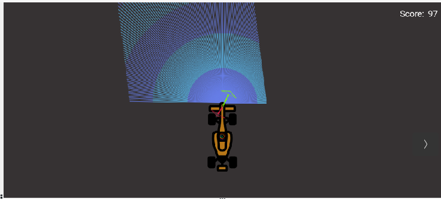
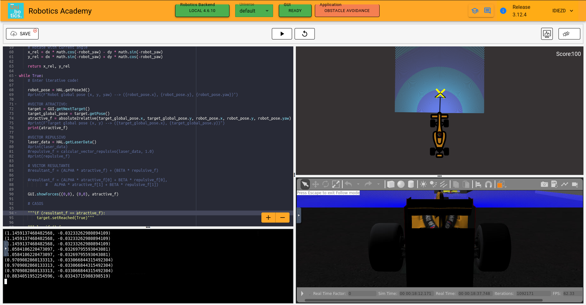
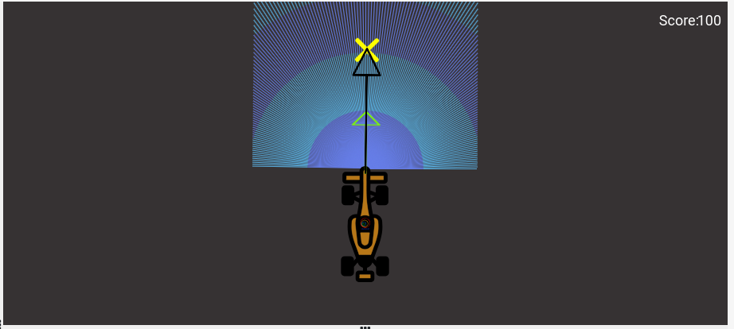

 # PRACTICE 4: DOCUMENTATION OF GLOBAL NAVIGATION

 Irene Diez de Toro
 
 November 2024 - Third Year of Robotic Software Robotics Engineering

# 0. INTRODUCTION

For this third assignment of the course, a local navigation algorithm based on the ***"Virtual Force Field" (VFF)*** has been programmed for a Formula 1 car that moves around the track, avoiding any obstacles along the way. To detect obstacles and the boundaries of the track, the car is equipped with a **laser sensor** at the front. Additionally, there are several *waypoints* assigned on the track, which serve as *targets* that the car passes through until it reaches the finish line. These targets are used to generate an **attractive force vector** that guides the car towards each goal until it completes the lap. In this case, we were also asked, as a complementary but not primary task, to make the car as fast as possible, avoiding slow movement.

**NOTE THAT:** In almost all the photos shown in this documentation, there is a problem with the colors. This is because, in class, the order of the vectors was unintentionally explained incorrectly when placing the function to represent the vectors. The only photo with the correct colors is the one shown in the description of my algorithm.

# 1. THEORICAL CONCEPTS

This exercise requires us to implement a global (and local) navigation using Motion Planning. Below is the complete theory that explains how to do it.

**Robot Navigation** involves all the related tasks and algorithms required to take a robot from point A to point B autonomously without making any collisions. It is a well-studied topic in Mobile Robotics, comprising volumes of books! The problem of navigation is broken down into the following subproblems:

- **Localisation**: The robot needs to know where it is.
- **Collision Avoidance**: The robot needs to detect and avoid obstacles.
- **Mapping**: The robot needs to remember its surroundings.
- **Planning**: The robot needs to be able to plan a route to point B.
- **Explore**: The robot needs to be able to explore new terrain.

**ROBOT NAVIGATION PROBLEMS**

Some of the ways to achieve the task of navigation are as follows:

- **Vision-Based**: Computer Vision algorithms and optical sensors, like LIDAR sensors, are used for Vision-Based Navigation.
- **Inertial Navigation**: Airborne robots use inertial sensors for Navigation.
- **Acoustic Navigation**: Underwater robots use SONAR-based Navigation Systems.
- **Radio Navigation**: Navigation using RADAR technology.

The problem of **Path Planning** in navigation is dealt with in two ways: **Global Navigation** and **Local Navigation**.

**--GLOBAL NAVIGATION--**

Motion Planning is a term used in robotics to find a sequence of valid configurations that moves the robot from source to destination. Motion Planning algorithms find themselves in a variety of settings, be it industrial manipulators, mobile robots, artificial intelligence, animations or study of biological molecules. There are mainly 2 methods to solve the exercise, Gradient Path Planning and Sampling Based Path Planning:

**GRADIENT PATH PLANNING**

One such method for Motion Planning is Gradient Path Planning. GPP works on the principle of potential fields. The obstacles in the path serve as potential wall to the path planner, and the target serve as potential well. By combining all the potential walls and wells, a path is constructed as a downward slope. The robot follows that path to reach it’s destination. Gradient Path Planning can be implemented using Brushfire Algorithm or Wave Front Algorithm. Next section explains the working of Wave Front Algorithm.

- ***Wave Front Algorithm***: is BFS based approach to build a path from source to destination. The algorithm works by assigning weights to a grid of cells. Given the source and target, the algorithm starts from the target node and moves outwards like a ripple, while progressively assigning weights to the neighboring cells.

- ***Assigning Weights***: As for obstacles, additional weights are added to the cells that are close to obstacles. Intuitively, the weights represent the superposition of waves that are reflected from the walls of obstacles.

- ***Superposition of Waves***: The algorithm stops upon reaching the source. To navigate through the generated path, the robot follows the path indicated by decreasing weights (a downhill drive). A grayscale image representation quite clearly depicts the path the robot might follow!

**SAMPLING BASED PATH PLANNING**

Sampling based Path Planning employs sampling of the state space of the robot in order to quickly and effectively plan paths, even with differential constraints or those with many degrees of freedom. Some of the algorithms under this class are:

- ***Probabilistic Roadmap***: These methods work by randomly sampling points in the workspace. Once the desired number of samples are obtained, the roadmap is constructed by connecting the random samples to form edges. On the resulting graph formed, any shortest path algorithm (A*, Dijkstra, BFS) is applied to get our resulting path.
 
- ***Tree Based Planner***: Tree Based Planners are very similar to Probabilistic Roadmaps, except for the fact that there are no cycles involved in tree based planners. There are a variety of tree based planners, like RRT, EST, SBL and KPIECE. These algorithms work heuristically, working from the root node, a tree (a graph without cycles) is constructed.

**--LOCAL NAVIGATION--**

Once the global path is decided, it is broken down into suitable waypoints. The robot navigates through these waypoints to reach its destination. Local Navigation involves a dynamically changing path plan, taking into consideration the changing surroundings and vehicle constraints. Some examples of such algorithms would be **Virtual Force Field**, **Follow Wall**, **Pledge Algorithm**, etc.

# 2. MY ALGORITHM
My algorithm is designed to control the movement of a robot using an approach based on *attractive* and *repulsive forces*. I initialize two parameters, **ALPHA** and **BETA**, which weigh the influence of each force on the robot's movement. Then, I calculate a repulsive vector based on the laser sensor readings, where the repulsion is stronger as obstacles get closer. I also convert the target coordinates into the robot's local reference frame and limit the magnitude of the vectors to avoid abrupt movements. In a main loop, I obtain the robot's current position and the target coordinates, calculate the distance between them, and compute the attractive and repulsive forces. If the robot is close to the target, I mark it as reached; otherwise, I calculate a *resultant force vector* and use it to direct the robot's movement. Additionally, I display the forces on the graphical interface to monitor the robot's behavior. The image shows the final vectors during the program.

  
  &nbsp;&nbsp;&nbsp;

# 3. THE PROCESS

During the creation of the program, I went through several important steps. First, I developed the *attraction vector*. In this case, I didn't take long to implement it, as it only involved transferring the coordinates of the car and the target. However, without realizing it, this implementation wasn't entirely correct and would cause problems later on, as can be seen in the first image.

  
  &nbsp;&nbsp;&nbsp;

The second step was to create the *repulsion vector* using the values from the laser. At this point, I made numerous modifications due to calculation errors, which are detailed later in the difficulties section. Finally, I calculated the *resulting vector*. This last step did not present me with significant difficulties, as I only needed to adjust the coefficient values in the sum a couple of times until I found the correct ones.

However, as shown in the image and described in the process of creating the repulsion vector, in the first functional version I developed, I could only detect obstacles that were very close. This meant that when there were no visible obstacles, the resulting vector appeared incorrectly. Once I made the necessary changes, I was able to adjust the car's speed (initially, I considered deriving it from the resulting vector, but that wasn't viable) and the direction, which is based on the angle of that vector.

  
  &nbsp;&nbsp;&nbsp;

In the last image, you can see that I was practically close to solving the problem. As observed, the repulsion vector was well-scaled, but the attraction vector was too long, giving it too much influence on the resulting vector. This caused the movement to be uncontrolled and the robot not to avoid obstacles properly. Ultimately, I understood that I also needed to limit the attraction vector to balance both vectors and make the algorithm work correctly.

  
  &nbsp;&nbsp;&nbsp;

# 4. DIFICULTIES

During the development of this project, I faced several challenges that affected the progress and implementation of the car’s navegation algorithm.

The biggest problem I faced was obtaining and generating the **repulsive vector**, which is derived from the laser sensor data. At first, I struggled a lot to understand the concept related to the laser theory, as I didn’t have the opportunity to work with it in the first exercise, and last year, when we covered it in another subject, I didn’t fully grasp it.

After several days of analyzing it and with the help of the code I already had, I managed to create an initial vector. In that case, I took the laser values, calculated the corresponding components, and summed them. I noticed that it was necessary to invert the values since the force needed to push in the opposite direction. This process took me quite a bit of time before I got it to work correctly.

When the vector began to work relatively well, obstacles were successfully avoided, except in the case of distant targets, where the robot would get stuck to a wall and wouldn’t move away. After hearing a classmate’s question and the professor's response, I realized that my calculation was incorrect. What I actually needed to do was calculate the *inverse* and the *average* of the distances, so that all the distances were taken into account, but with the closest ones having the most influence.

After a few adjustments, I managed to solve the issue and optimize the calculation. Below are two images of the vectors I had initially generated:

 
  &nbsp;&nbsp;&nbsp;
  
  &nbsp;&nbsp;&nbsp;

# 5. VIDEO OF THE ALGORITHM

Click on the link to see it! -> [Global Navigation]() :)
