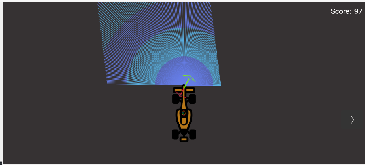
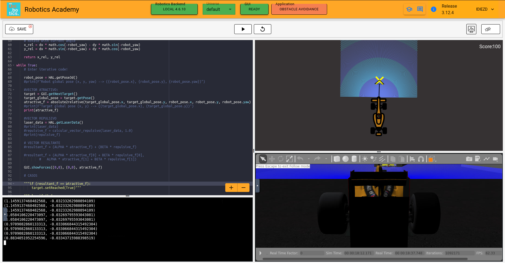
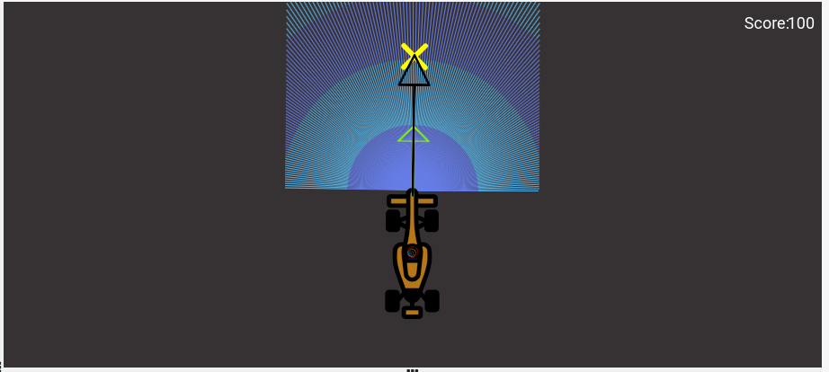
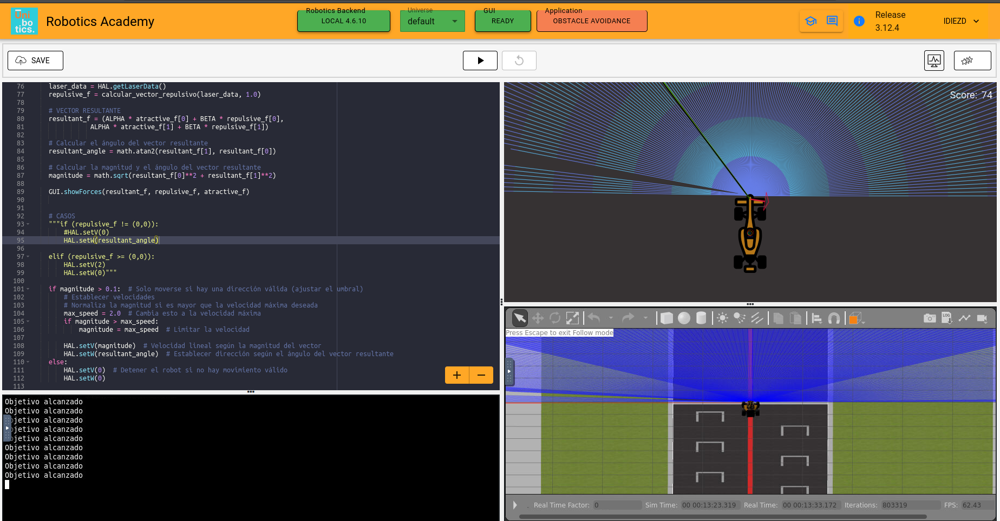
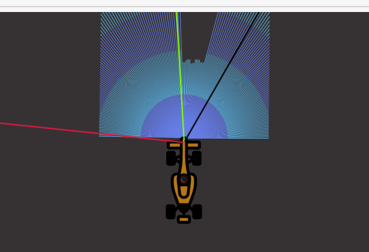

 # PRACTICE 3: DOCUMENTATION OF OBSTACLE AVOIDANCE

 Irene Diez de Toro
 
 October 2024 - Third Year of Robotic Software Robotics Engineering

# 0. INTRODUCTION

For this third assignment of the course, a local navigation algorithm based on the ***"Virtual Force Field" (VFF)*** has been programmed for a Formula 1 car that moves around the track, avoiding any obstacles along the way. To detect obstacles and the boundaries of the track, the car is equipped with a **laser sensor** at the front. Additionally, there are several *waypoints* assigned on the track, which serve as *targets* that the car passes through until it reaches the finish line. These targets are used to generate an **attractive force vector** that guides the car towards each goal until it completes the lap. In this case, we were also asked, as a complementary but not primary task, to make the car as fast as possible, avoiding slow movement.

# 1. THEORICAL CONCEPTS

This exercise requires us to implement a local navigation algorithm called the **Virtual Force Field Algorithm**. Below is the complete theory regarding this algorithm.

**NAVIGATION**

**Robot Navigation** involves all the related tasks and algorithms required to take a robot from point A to point B autonomously without making any collisions. It is a well-studied topic in Mobile Robotics, comprising volumes of books! The problem of navigation is broken down into the following subproblems:

- **Localisation**: The robot needs to know where it is.
- **Collision Avoidance**: The robot needs to detect and avoid obstacles.
- **Mapping**: The robot needs to remember its surroundings.
- **Planning**: The robot needs to be able to plan a route to point B.
- **Explore**: The robot needs to be able to explore new terrain.

**ROBOT NAVIGATION PROBLEMS**

Some of the ways to achieve the task of navigation are as follows:

- **Vision-Based**: Computer Vision algorithms and optical sensors, like LIDAR sensors, are used for Vision-Based Navigation.
- **Inertial Navigation**: Airborne robots use inertial sensors for Navigation.
- **Acoustic Navigation**: Underwater robots use SONAR-based Navigation Systems.
- **Radio Navigation**: Navigation using RADAR technology.

The problem of **Path Planning** in navigation is dealt with in two ways: **Global Navigation** and **Local Navigation**.

**GLOBAL NAVIGATION**

Global Navigation involves the use of a map of the environment to plan a path from point A to point B. The optimality of the path is based on the length of the path, the time taken to reach the target, using permanent roads, etc. Global Positioning System (GPS) is one example of Global Navigation. The algorithms used in such systems may include Dijkstra, Best First, or A*, etc.

**LOCAL NAVIGATION**

Once the global path is decided, it is broken down into suitable waypoints. The robot navigates through these waypoints to reach its destination. Local Navigation involves a dynamically changing path plan, taking into consideration the changing surroundings and vehicle constraints. Some examples of such algorithms would be **Virtual Force Field**, **Follow Wall**, **Pledge Algorithm**, etc.

**VIRTUAL FORCE FIELD ALGORITHM**

The **Virtual Force Field Algorithm** works in the following steps:

1. The robot assigns an **attractive vector** to the waypoint that points towards the waypoint.
2. The robot assigns a **repulsive vector** to the obstacle according to its sensor readings that points away from the waypoint. This is done by summing all the vectors that are translated from the sensor readings.
3. The robot follows the vector obtained by summing the target and obstacle vectors.

**DETERMINING THE VECTORS**

- **Target Vector**: The target vector can be easily obtained by subtracting the position of the car from the position of the next waypoint. In order to implement this on the GUI interface of the exercise, in addition to the vector obtained by subtracting, we need to apply a rotation to the vector as well. The purpose of rotation is to keep the target vector always in the direction of the waypoint and not in front of the car.
- **Obstacle Vector**: The obstacle vector is to be calculated from the sensor readings we obtain from the surroundings of the robot. Each obstacle in front of the car, is going to provide a repulsive vector, which we will add to obtain the resultant repulsive vector. Assign a repulsive vector, for each of the 180 sensor readings. The magnitude of the repulsive vector is inversely proportional to the magnitude of the sensor reading. Once, all the repulsive vectors are obtained they are all added, to get the resultant.
- **Direction Vector**: To obtain the direction vector we should add the target vector and the obstacle vector. But, due to an inherent problem behind the calculation of the obstacle vector, we cannot simply add them to obtain the resultant. We are required to keep moving forward for the purpose of this exercise. Hence, the component of the direction vector in the direction of motion of the car, has no effect on the motion of the car. Therefore, we can simply leave it as a constant, while adjusting the vector responsible for the steering of the car. It is the steering, that will in fact, provide us with the obstacle avoidance capabilities. Hence, the steering is going to be controlled by the Direction Vector.

# 2. MY ALGORITHM

  
  &nbsp;&nbsp;&nbsp;

# 3. THE PROCESS

  
  &nbsp;&nbsp;&nbsp;

  
  &nbsp;&nbsp;&nbsp;

  
  &nbsp;&nbsp;&nbsp;

# 4. DIFICULTIES

 
  &nbsp;&nbsp;&nbsp;
  
  &nbsp;&nbsp;&nbsp;

# 5. VIDEO OF THE ALGORITHM

Click on the link to see it! -> [Obstacle Avoidance]() :)
