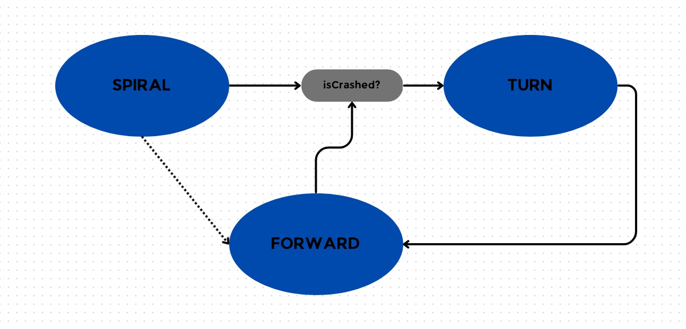
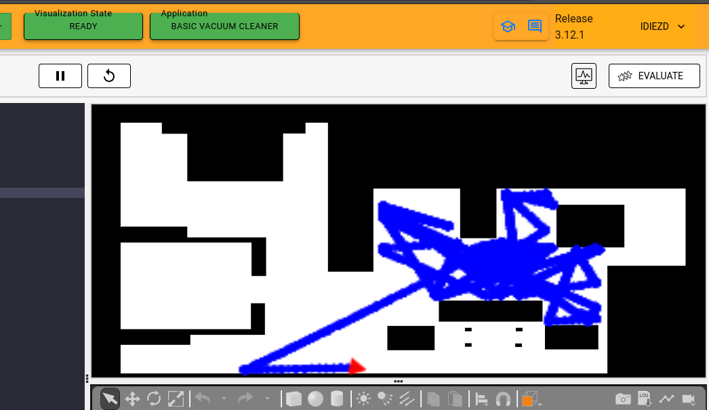
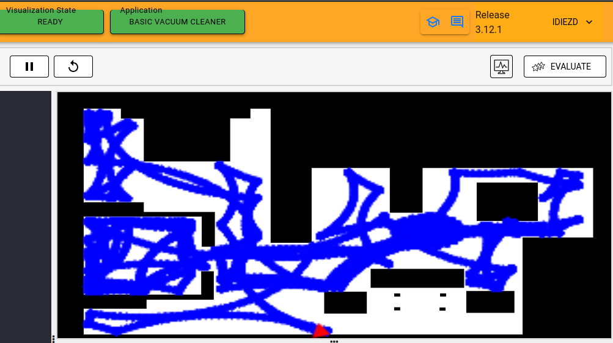

# PRACTICE 1: DOCUMENTATION OF VACUUM CLEANER

 Irene Diez de Toro
 
 September 2024 - Third Year of Robotic Software Robotics Engineering

# 0. INTRODUCTION

For the first practice of this course, the objective was to program an exploration algorithm for a low-end vacuum cleaner. To accomplish this, we had access to laser sensors and the bumper, as we could not use the robot's localization or the map of the environment (in this case, a house). It had to be implemented using a properly defined state machine and being a reactive system, meaning avoiding loops and calls to sleep functions to prevent blocking the main execution flow. Additionally, the requirement, as previously inferred, was to cover the maximum space possible while avoiding getting stuck in just one area of the house.

# 1. THEORICAL CONCEPTS

To create the algorithm solution we need the next theorical concepts:
- ***Coverage Algorithms***: Coverage Path Planning is an important area of research in Path Planning for robotics, which involves finding a path that passes through every reachable position in its environment. In this exercise, We are using a very basic coverage algorithm called Random Exploration. Coverage algorithms are divided into two categories :Offline coverage use fixed information and the environment is known in advance. Genetic Algorithms, Neural Networks, Cellular Decomposition, Spanning Trees are some examples to name a few. And Online Coverage.
- ***Base Movement***: The problem of coverage involves two standard basic motions, which are used as a base for other complex coverage algorithms.
   - Spiral Motion: The robot follows an increasing circle/square pattern.
   - Boustrophedon Motion: The robot follows an S-shaped pattern.
- ***Analysis of Coverage Algorithms***: Any coverage algorithm is analyzed using the given criterion.
   - Environment Decomposition This involves dividing the area into smaller parts.
   - Sweep Direction: This influences the optimality of generated paths for each sub-region by adjusting the duration, speed, and direction of each sweep.
   - Optimal Backtracking: This involves the plan to move from one small subregion to another. The coverage is said to be complete when there is no point left to backtrack.
 
 And some hints given that was fundamental for the development of the practice:
 - ***Random Angle Generation***: The most important task is the generation of a random angle. There are 2 ways to achieve it.
   - Random Duration: By keeping the angular_velocity fixed, the duration of the turn can be randomized, in order to point the robot towards a random direction.
   - Random Angle: This method requires calculation. We generate a random angle and then turn towards it. Approximately an angular speed of 3 turns the robot by 90 degrees.
- ***Dash Movement***: Once the direction has been decided, we move in that direction. This is the simplest part, we have to send velocity command to the robot, until a collision is detected. A word of caution though, whenever we have a change of state, we have to give a sleep duration to the robot to give it time to reset the commands given to it.
- ***Spiral Movement***: Using the physical formula v=r⋅ω. In order to increase r, we can either increase v or decrease ω, while keeping the other parameter constant. Experimentally, increasing v has a better effect than decreasing ω.

# 2. MY ALGORITHM

My algorithm is designed to allow the robotic vacuum cleaner to move efficiently, using a navigation strategy based on wall bouncing. The goal of this technique is to maximize the coverage of the area while avoiding obstacles, ensuring that the vacuum cleaner explores the largest possible space available. The state machine used is:

The algorithm begins in an initial state called SPIRAL, where the vacuum cleaner moves in a spiral pattern. This movement not only allows the vacuum to advance and clean the area effectively, but also gradually increases its speed, optimizing cleaning time. As the vacuum moves forward, the bumper is used to detect any obstacles that may interrupt its path.

When the sensor detects a collision, the algorithm transitions to the TURN state. In this state, the vacuum cleaner stops and prepares to turn in a random direction, thus avoiding the obstacle that caused the collision. This random turn is implemented using a timer that determines the duration and angle of the turn, allowing for more dynamic maneuvering in tight spaces.

Once the vacuum has completed its turn, the algorithm switches to the FORWARD state, where the vacuum moves forward again in a straight line. This combination of states ensures that the vacuum not only avoids obstacles but also continues cleaning efficiently. The state transitions occur smoothly, enabling the robot to quickly react to the changing conditions in its environment.

# 3. THE PROCESS
During the development of this project, several key ideas shaped the final outcome. Initially, I did not plan to use an initial spiral pattern. The theory suggested using an "S" shaped movement, which I believed was the best option to cover as much space as possible. However, this approach proved to be too complicated. After the recomendation of the professor, I implemented the spiral movement instead, which turned out to be more efficient and manageable.

Another important adjustment was my original intention for the robot to move in straight lines in random directions. While this seemed like a good way to explore, I quickly realized that it didn't cover enough ground and increased the risk of the robot colliding with obstacles or getting stuck. By rethinking this approach, I was able to improve the robot's ability to navigate the space more effectively.

 
 

# 4. DIFICULTIES

Throughout the development of this project, I encountered several challenges that required rethinking and adjusting my approach.

1. Placing states in functions: At the beginning, I structured the program by placing the state logic inside separate functions, which left the main loop almost empty. This approach seemed logical at first, as I wanted to keep the loop clean and organized. However, I quickly realized that this structure made the code harder to follow and maintain, and it complicated the flow of state transitions. After some reflection, I restructured the program to include only the essential functions.

2. Spiral movement: The formula for the spiral movement was straightforward, but I initially made a small mistake by placing the variable updates in the wrong location. Specifically, I accidentally updated the variables controlling the robot’s speed and angular velocity in a way that caused it to trace an oval rather than a proper spiral. It took some time to figure out why the robot was behaving this way, but once I identified the issue, I corrected the variable placement, ensuring the spiral expanded correctly.

3. Using sleep: At one point, I used sleep(), which led to unintended delays. This was an oversight, as the project specifically required avoiding sleep() to maintain a non-blocking execution. After spotting this, I removed all sleep() calls and ensured the program relied on more appropriate methods for managing time without blocking the main thread.

4. Writing this blog: Finally, creating this blog required learning how to use GitHub Pages, which was a completely new experience for me. I had to familiarize with the platform, including how to set up, format, and publish content.

# 5. FINAL VIDEO OF THE ALGORITHM

Se adjunta un video demostrativo que muestra el algoritmo en funcionamiento. [Incluir enlace al video aquí]

---

### Conclusión
El diseño del algoritmo ha sido un proceso iterativo, donde cada prueba ha proporcionado información valiosa para mejorar la eficiencia de la aspiradora. La implementación de una FSM ha permitido un control más efectivo del movimiento, adaptándose a las condiciones del entorno.

---

